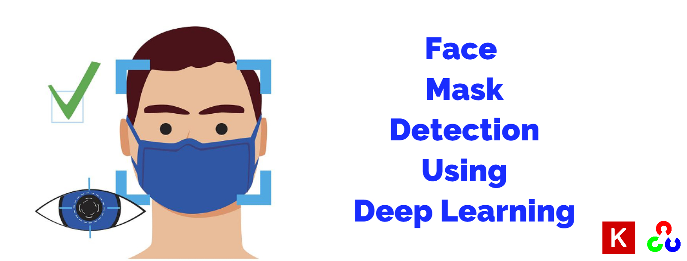

<!-- PROJECT TITLE -->
<h1 align="center">Face Mask Detection Using Deep Learning</h1>

<!-- HEADER -->
<p align="center">
  
</p>

<!-- PROJECT DESCRIPTION -->
## <br>**➲ Project description**
Face mask detection implementation using CNN model with keras, where the model trained on collection of images of people wearing mask and other not,
so the model can classify every image if the face wearing mask or not,
first we use opencv haarcascade classifier to detect face and then run the CNN model to classify if this face has mask or not,
and finally draw bounding box around face and output class "With Mask" or "Without Mask"

<!-- PREREQUISTIES -->
## <br>**➲ Prerequisites**
This is list of required packages and modules for the project to be installed :
* <a href="https://www.python.org/downloads/" target="_blank">Python 3.x</a>
* OpenCV 
* Numpy 
* Tensorflow 
* Keras 

<!-- INSTALLATION -->
## <br>**➲ Installation**
1. Clone the repo
   ```sh
   git clone https://github.com/omaarelsherif/Face-Mask-Detection-Using-Deep-Learning.git
   ```
2. Run the code from cmd
   ```sh
   python face_mask_detection.py "FLAG" "IMAGE_PATH"/"VIDEO_PATH"
   ```
   For Image:
   ```sh
   python face_mask_detection.py img Images/img1.jpg
   ```
   For Video:
   ```sh
   python face_mask_detection.py vid Videos/video.mp4
   ```
   For Cam:
   ```sh
   python face_mask_detection.py cam
   ```

<!-- OUTPUT -->
## <br>**➲ Output**
Here's the project output where the input is an image containing single or multi faces or a video and the output will be the same image with bounding boxs around all faces and a label showing if a person face wearing mask or not and same thing with video or cam as follows:

<h3>Face Mask Detection - Image Output</h3>


<h3>Face Mask Detection - Video Output</h3>


<!-- REFERENCES -->
## <br>**➲ References**
These links may help you to better understanding of the project idea and techniques used :
1. CNN for image classification : https://bit.ly/3D6zCvx
2. OpenCV haarcascade : https://bit.ly/39HWt3D
   
<!-- CONTACT -->
## <br>**➲ Contact**
- E-mail   : [omaarelsherif@gmail.com](mailto:omaarelsherif@gmail.com)
- LinkedIn : https://www.linkedin.com/in/omaarelsherif/
- Facebook : https://www.facebook.com/omaarelshereif
  
